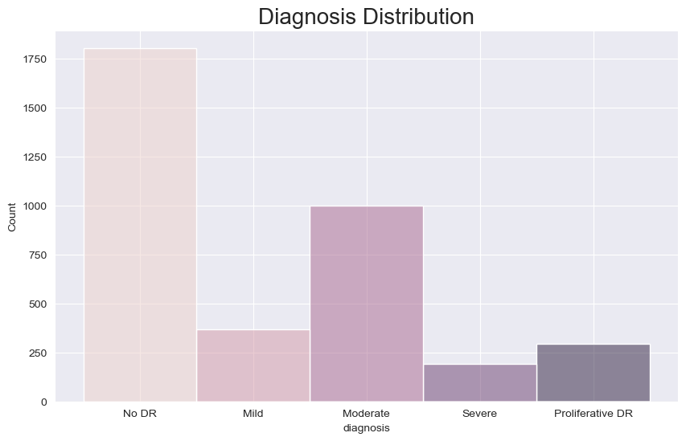
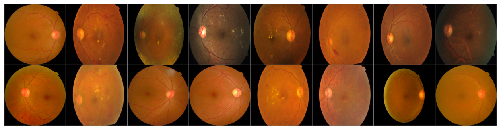
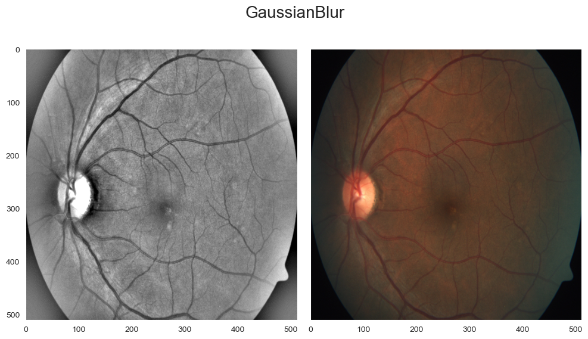
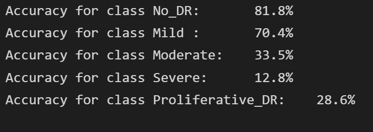

# Blindness Detection

Diabetic retinopathy (DR) also known as diabetic eye disease, is a medical condition in which damage occurs to the retina due to diabetes mellitus. It is a leading cause of blindness. 

Diabetic reinopathy affects up to 80 percent of those who have had diabetes for 20 years or more. This disease has no early warning signs. 

The figure below shows an example of a healthy patient and a patient with _diabetic retinopathy_ as viewed by fundus photography.

## 2. Problem Identification
___
Now, imagine being able to detect diabetic retinopathy before it is too late. Millions of people suffer from diabetic retinopathy. My goal is to build a machine learning model to speed up disease detection.

Diabetic retinopathy is an eye disease that can potentially cause sebere vision loss and blindness. 
## 3. Data Wrangling
___
The dataset was acquired using [Kaggle API](https://github.com/Kaggle/kaggle-api).

Once installed, you can just run the following command: 

`kaggle competitions download -c aptos2019-blindness-detection -p './data/external/`

## Exploratory Data Analysis
___
We are provided with a large set of retina images taken usin _fundus photograpy_ under a variety of imaging conditions.

A clinical has rated each image for the severity fo __diabetic retinopathy__ on a scale of 0 to 4:

| Severity | Description|
| -------- | ---------- |
| 0 | No DR|
| 1 | Mild |
| 2 | Moderate | 
| 3 | Severe |
| 4 | Proliferative DR|

The train dataset has `3662` images

The test dataset has `1928` images

We can see the Diagnosis Distribution. In this figure we can notice that the classes are unbalances. Images without the disease are predominant. 

Here is a batch of images for training:

## Pre-Processing and Training Data Development
---
Here, I created a custom Dataset class that implemented three functions `__init__`, `__len__`, and `__getitem__`. The images are store in *train_images* and their labels are stored separately in a *CSV* file.

The images were resized to (256 x 256) pixels and normalized before converting them to tensors for modeling. 

To see if we can get more details in the image, I tried modifying the contrast of the image and reducing the color channels from R, G, B to Gray scale.

We can see here the difference on the same image between the 3 and 1 color channels.

## Modeling

The base model consisted of :
- `Conv2d` --> `ReLU` --> `MaxPool2d` --> `Conv2d` --> `ReLU` --> `MaxPool2d` --> `FC1` --> `FC2` --> `FC3`

This model got an accuracy of __59%__

The modified model consisted of:
- `Conv2d` --> `ReLU` --> `MaxPool2d` --> `Dropout` --> `Conv2d` --> `ReLU` --> `MaxPool2d` --> `Dropout` --> `FC1` --> `ReLU` --> `FC2` --> `ReLU` 

Accuracy of the network on test images:	__69.0 %__

With this result, we can see that our model is predicting better than just by chance. It took a few hours for the training process.

We can see here the class inbalance problem. This results reflect the lack of images for training for the three more severe cases.

## Results

On average we get an accuracy of 69.0 %. This can be the result of many constraints. First, training on a average laptop takes a long time. I tried uploading all the eye images to a cloud service, but I could not get it done due to every time the connection was lost and I had to reupload the images. The cloud service that I used is _PaperSpace_ which is recommended by Springboard. Secondly, The number of images I think was not enough for training. I think the moudel would have done better if there were more images for the 'moderate', 'severe', and 'proliferative DR' classes. For futher work, I recomend using a different cloud service for storage and to get more images.